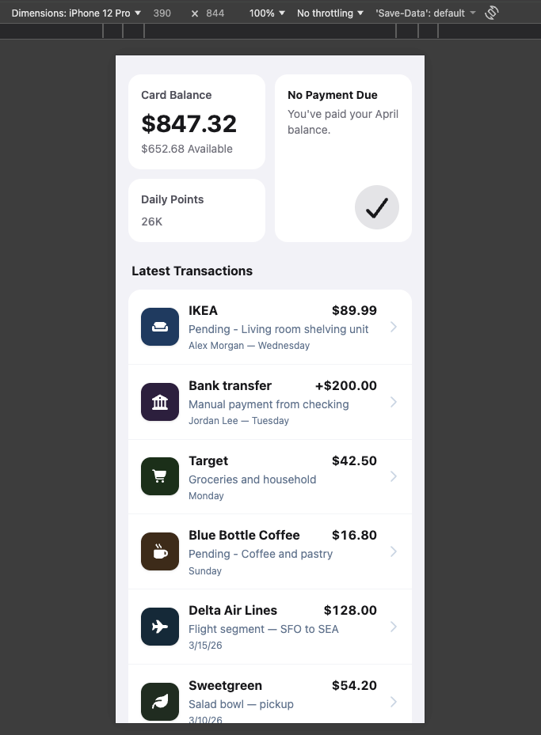
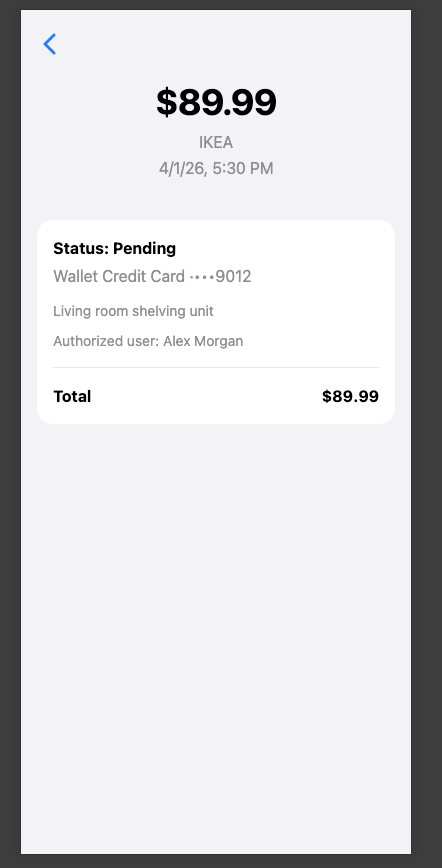

# Wallet App

Mobile-first wallet UI built with **React**, **TypeScript**, **Vite**, and **Tailwind CSS**. Data is loaded from local JSON files; icons use **Font Awesome**.

### Live demo (Vercel)

- **App:** [https://wallet-app-pi-beryl.vercel.app/](https://wallet-app-pi-beryl.vercel.app/)

---

## Run locally

**Requirements:** [Node.js](https://nodejs.org/) 20+ (or current LTS) and npm.

```bash
# Clone the repository
git clone <YOUR_REPO_URL>
cd wallet-app

# Install dependencies
npm install

# Start dev server (http://localhost:5173)
npm run dev
```

Other scripts:

| Command | Description |
|--------|-------------|
| `npm run build` | Typecheck + production build to `dist/` |
| `npm run preview` | Serve the production build locally |
| `npm run lint` | Run ESLint |

---

## Pages

### Transactions list (`/`)

- **Card balance** — current balance and available amount (limit minus balance from JSON).
- **Daily points** — points for “today” using the seasonal rules in code.
- **No payment due** — message from `wallet.json`.
- **Latest transactions** — scrollable list (10 items first, **Show more** to expand). Each row opens the detail screen.
- Tap a row to open **Transaction detail**.

### Transaction detail (`/transaction/:transactionId`)

- Back button returns to the list (`/`).
- Hero: amount, merchant name, date and time.
- Card: status (Approved / Pending), payment method, description, authorized user (if any), transaction type, **Total**.

---

## Screenshots

| Transactions list | Transaction detail |
| :---: | :---: |
|  |  |
